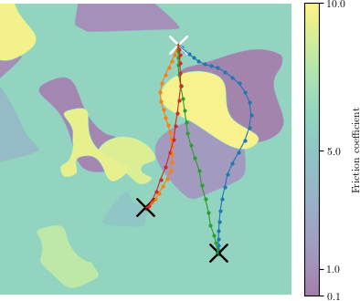

# Code for the TRADYN model

This repository contains code and evaluations for the TRADYN model presented in the paper "Context-Conditional Navigation with a Learning-Based Terrain- and Robot-Aware Dynamics Model", accepted for publication at ECMR 2023

|  | 
|:--:| 
| Terrain- and robot-aware throttle-control-efficient navigation. Paths are planned from the white cross to the black cross. A heavy robot (m = 4 kg, blue, orange) is allowed to take longer detours to avoid high-friction terrain (yellow) than a light robot (m = 1 kg, green, red), as the dissipated energy is higher for the heavy robot. |


Guttikonda, Suresh and Achterhold, Jan and Li, Haolong and Boedecker, Joschka and Stueckler, Joerg: \
**Context-Conditional Navigation with a Learning-Based Terrain- and Robot-Aware Dynamics Model**\
Accepted at the IEEE European Conference on Mobile Robots (ECMR) 2023.

Preprint: https://arxiv.org/abs/2307.09206

If you use the code, data or models provided in this repository for your research, please cite our paper as:
```
@inproceedings{
    guttikonda2023context,
    title={Context-Conditional Navigation with a Learning-Based Terrain- and Robot-Aware Dynamics Model},
    author={Suresh Guttikonda Jan Achterhold and Haolong Li and Joschka Boedecker and Joerg Stueckler},
    booktitle={Accepted at the IEEE European Conference on Mobile Robots (ECMR) 2023},
    year={2023},
}
```

<br/>

*Note: The behaviour and results of the numeric algorithms used in this code varies among
computing architectures, hardware, and driver versions, even when using the same Python package versions,
enabling deterministic computations, and when using fixed seeds.
Thus, when re-running this code, results can slightly vary from the paper.*

## 1. Install environment
We use Python 3.8 with CUDA 11.6 / CuDNN 8.4.1.
```
pip install --upgrade pip
pip install torch==1.13.0+cu116 --extra-index-url https://download.pytorch.org/whl/cu116
pip install torch-scatter -f https://data.pyg.org/whl/torch-1.13.0+cu116.html
pip install -r requirements.txt
```


All python commands of the form `python -m ...` should be executed from the root directory of this repository.
**Important note:** Training data will be stored in `data/`, trained models in `experiments/`.
Please be aware that data and experiments take up several GB of disk space,
so you may symlink these directories to somewhere
where you can store large amounts of data.

## 2. Download terrain profiles (landscapes)
The terrain profiles are hosted at the Keeper service of the Max Planck Society. Download and extract them with
```
wget https://keeper.mpdl.mpg.de/f/d19bb3e616484941b3ce/?dl=1 -O landscapes.tgz
tar xvz -f landscapes.tgz -C context_exploration/data/envs/
```
See `archive-metadata.md` at https://keeper.mpdl.mpg.de/d/f72a314ef6464190b10b/ for information on licensing of the terrain profiles.

## 3. Generate or download trajectory data
Run
```
python -m context_exploration.data.data_generation
```
to generate trajectory data, or 
```
mkdir -p data/experience/unicycle_robotvary_terrainpatches
wget https://keeper.mpdl.mpg.de/f/c0b370ca6c824b7fba66/?dl=1 -O data/experience/unicycle_robotvary_terrainpatches/np_container_0-14999.npz
```
to download.
See `archive-metadata.md` at https://keeper.mpdl.mpg.de/d/f72a314ef6464190b10b/ for information on licensing of the trajectory data.

## 4. Train or download models
You can either download pretrained models (also providing evaluation files), or run training and evaluation yourself.

### Download pre-trained models
You can download pre-trained models (and their corresponding evaluations), with
```
wget https://keeper.mpdl.mpg.de/f/37dcc2614b044a598186/?dl=1 -O trained_models.tgz
mkdir -p experiments/train_model
tar xvz -f trained_models.tgz -C experiments/train_model/ --strip-components=1 trained_models
```
### Train models yourself


First, the experiments have to be initialized with
```
mkdir experiments
parallel < jobs/jobs_training_unicycle_init.txt
```
The commands in the above file should finish with an `InitializationFinishedInterrupt`. Then, to continue training, run each command in `jobs/jobs_training_unicycle_restart.txt`
until training finishes with exit code 0 (you would probably use your favourite job scheduling tool for this).
To circumvent the job scheduler, e.g., to continue training the first model, you could call
```
until pythonwcuda -m context_exploration.train_model restart_base=model_env=unicycle_robotvary_terrainpatches_uselocalctx=True_seed=1
; do sleep 1; done
```


### Evaluate trained models
To evaluate the prediction performance of the models, run each command in `jobs/jobs_unicycle_eval_prediction.txt`.

To evaluate the planning performance of the models, run each command in `jobs/jobs_unicycle_eval_planning.txt`.


# Create plots
To generate the paper figures, see the notebook at [paper_figures/unicycle/paper_figures.ipynb](paper_figures/unicycle/paper_figures.ipynb) and [context_exploration/evaluation/notebooks/evaluation_unicycle.ipynb](context_exploration/evaluation/notebooks/evaluation_unicycle.ipynb).


## Errata
May 2024

* We have discovered an error in the code used to generate Figure 6 in the paper. The fix minimally changes the numbers reported in Figure 6, but does not affect the significance statements. We have fixed the bug in the branch [bugfix_plots](https://github.com/EmbodiedVision/tradyn/tree/bugfix_plots/).

* In Figure 5, we report an error on the velocity normalized to the range $[-1, 1]$ (Norm. velocity). In the branch [bugfix_plots](https://github.com/EmbodiedVision/tradyn/tree/bugfix_plots/), we have updated the plot to show the velocity error without rescaling.


* We have discovered an error in the implementation of (Achterhold & Stueckler, 2021, http://proceedings.mlr.press/v130/achterhold21a.html), which we build upon. In contrast to what is reported in (Achterhold & Stueckler, 2021), not the models with the minimal validation loss are used for the final evaluation, but those after a fixed number of training steps. The branch [bugfix_models](https://github.com/EmbodiedVision/tradyn/tree/bugfix_models/) contains an evaluation at minimal validation loss, including the updates for the plots mentioned above.

  * In terms of prediction error (Fig. 5) and control energy (Fig. 6), we found the two variants to yield comparable results.
  * Slightly different trajectories are followed compared to those shown in Figures 7 and 8. In both variants, terrain lookup avoids high-friction regions and yields a reduction in throttle control energy.
  * The updated models show a reduced terminal distance to the goal (Table 2):
    * +T, +C variant (original): [P20: 2.16mm / med: 3.85mm / P80: 5.61mm] 
    * +T, +C variant (updated): [P20: 1.70mm / med: 2.89mm / P80: 4.14mm] 
  * The number of failed tasks (Table 2) is similar (original: 6 / 0 / 14 / 0, updated: 7 / 0 / 13 / 0).


## Code license
See [LICENSE](LICENSE).

## Third-party software
The file `context_exploration/utils/sacred_utils/restartable_experiment.py` contains code from the
'sacred' experiment management repository at https://github.com/IDSIA/sacred,
licensed under the MIT License. A copy of the license is at
[context_exploration/utils/sacred_utils/SACRED_LICENSE](context_exploration/utils/sacred_utils/SACRED_LICENSE).
See the source file for case-by-case highlighting of the borrowed code excerpts.
